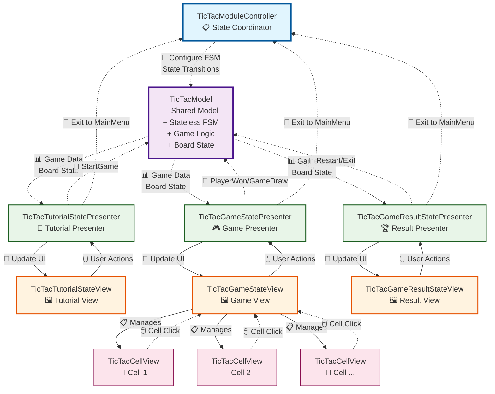

# TicTac Module Architecture FlowChart

## Architecture Components

### 🎯 **TicTacModel (Shared)**
- Единая модель для всех состояний
- Содержит Stateless FSM
- Управляет игровой логикой и состоянием доски

### 📋 **TicTacModuleController (State Coordinator)**
- Координирует переходы между состояниями
- Настраивает State Machine
- Обрабатывает выход в главное меню

### 📖 **Tutorial MVP State**
- **Presenter**: Управляет логикой tutorial состояния
- **View**: Отображает правила игры и кнопки

### 🎮 **Game MVP State**
- **Presenter**: Управляет игровой логикой и ходами
- **View**: Отображает игровое поле и управляет cell views

### 🏆 **Result MVP State**
- **Presenter**: Управляет отображением результата
- **View**: Показывает победителя или ничью

### 🔲 **Cell Views (Sub-components)**
- Отдельные view компоненты для каждой клетки
- Управляются Game View
- Используют собственные Stateless state machines

## Key Principles

1. **State-Based MVP**: Множественные MVP триады с общей моделью
2. **Centralized Coordination**: Controller координирует через FSM
3. **Shared State**: Общая модель обеспечивает консистентность
4. **Hierarchical Views**: Game View управляет Cell Views
